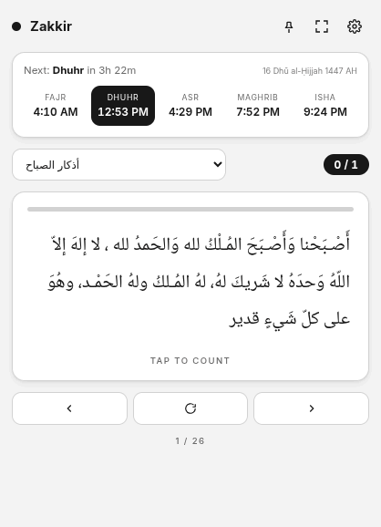

# Zakkir Desktop

Mini desktop app for prayer times and Azkar.

## User Interface Screenshots

### Home View

The main dashboard displays the current local time, calculated prayer timings for the day, a countdown to the next prayer, and progress counters for morning, evening, and sleep Azkar.

| Light Theme | Dark Slate Theme | Dark Navy Theme |
|:---:|:---:|:---:|
|  |  |  |

---

### Azkar & Supplications (Active Tracking & Accent Themes)

When reading Azkar or Quranic supplications, the interface presents the text in clear Arabic typography alongside translation and context, page progress indicators, navigation buttons, and an interactive count button. 

These screenshots show different color themes and corresponding accent colors:

#### Warm Themes

*   **Morning Azkar (Warm Theme / Orange Accent):**
    Shows a completed repetition count of 2/3.
    

*   **Quranic Supplications (Warm Theme / Burgundy Accent):**
    

#### Dark Themes

*   **Quranic Supplications (Dark Theme / Green Accent):**
    

*   **Quranic Supplications (Dark Navy Theme / Light Blue Accent):**
    

*   **Evening Azkar (Dark Slate Theme / Mint Accent):**
    

---

### Settings View

The settings panel exposes customization and calculation options, including location coordinates, computation methods, Arabic font configuration (style and scaling), application theme selection, custom accent color palettes, and interface scaling.

#### Light and Dark Themes (Standard Sizing)

| Light Theme | Dark Theme |
|:---:|:---:|
|  |  |

#### Full Configuration Scroll

This view displays the expanded Settings layout, showing the complete configuration options for text size previews, theme cards, custom color swatches, and interface zoom controls:

#### Dynamic Window Resizing (Horizontal Expansion)

Responsive scaling behavior of the application's interface when resized to a wide layout:

