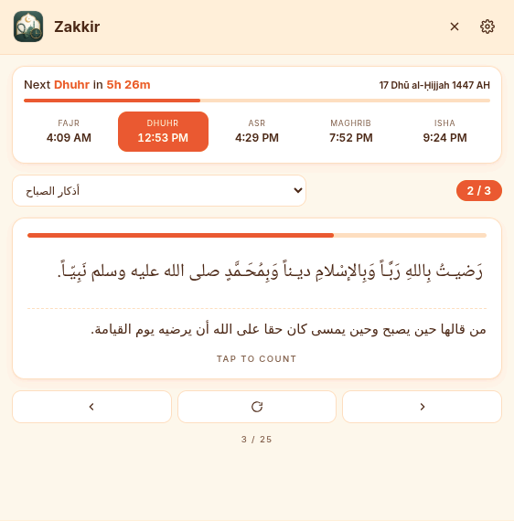
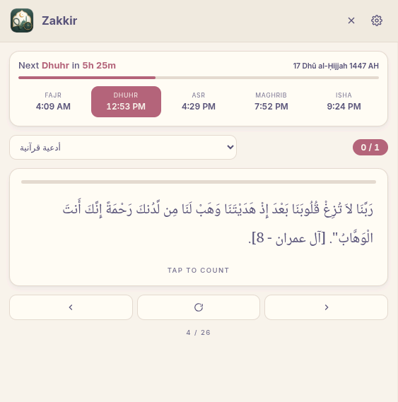
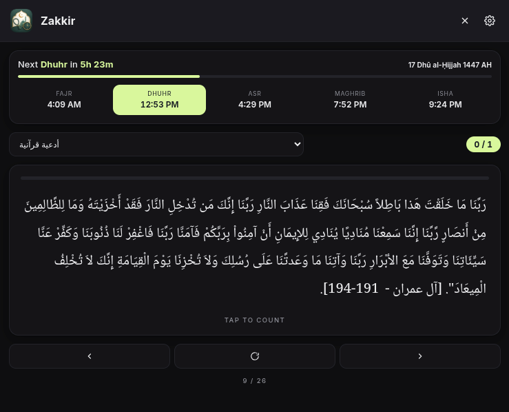
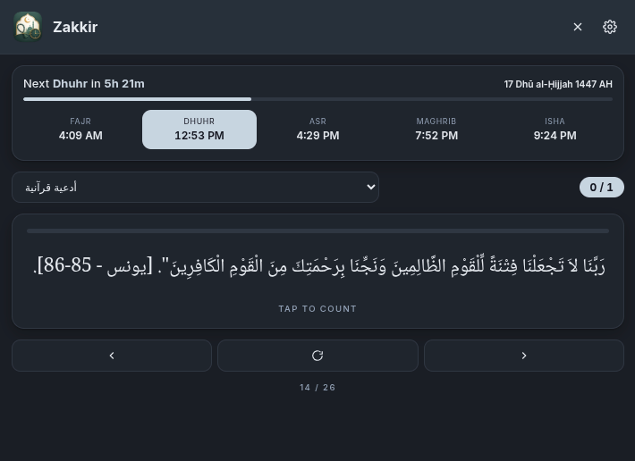
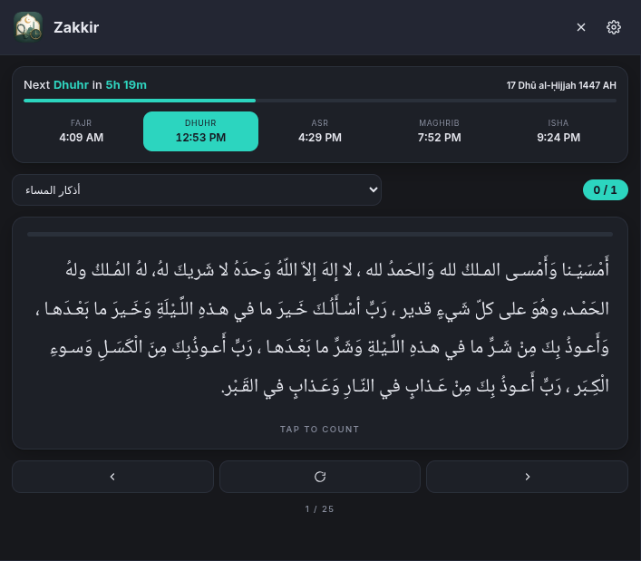
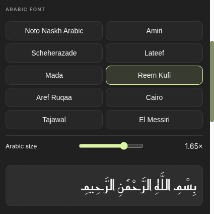
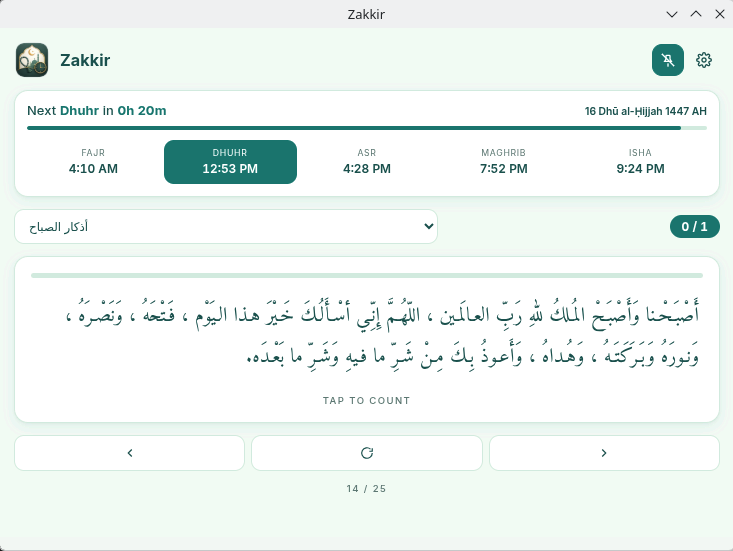

# Zakkir Desktop

Mini desktop app for prayer times and Azkar.

## Installation

| Platform         | Download                                                                                                                           | Install                                                     |
| ---------------- | ---------------------------------------------------------------------------------------------------------------------------------- | ----------------------------------------------------------- |
| Windows          | [Zakkir-Setup-1.2.1.exe](https://github.com/mohamedsameh20/Zakkir/releases/download/v1.2.1/Zakkir-Setup-1.2.1.exe)                 | Run the installer                                           |
| Debian / Ubuntu  | [zakkir-desktop_1.2.1_amd64.deb](https://github.com/mohamedsameh20/Zakkir/releases/download/v1.2.1/zakkir-desktop_1.2.1_amd64.deb) | `sudo dpkg -i zakkir-desktop_1.2.1_amd64.deb`               |
| Linux (AppImage) | [Zakkir-1.2.1.AppImage](https://github.com/mohamedsameh20/Zakkir/releases/download/v1.2.1/Zakkir-1.2.1.AppImage)                   | `chmod +x Zakkir-1.2.1.AppImage && ./Zakkir-1.2.1.AppImage` |

---

## Screenshots

### Home Dashboard

|                     Light Theme                      |                     Dark Slate Theme                      |                     Dark Navy Theme                     |
| :--------------------------------------------------: | :-------------------------------------------------------: | :-----------------------------------------------------: |
|  |  |  |

### Azkar & Supplications

|                         Warm Theme (Orange)                         |                      Warm Theme (Burgundy)                      |                      Dark Theme (Green)                      |
| :-----------------------------------------------------------------: | :-------------------------------------------------------------: | :----------------------------------------------------------: |
|  |  |  |

|                   Dark Navy Theme (Blue)                    |                       Dark Slate Theme (Mint)                       |
| :---------------------------------------------------------: | :-----------------------------------------------------------------: |
|  |  |

### Settings & Configuration

|                           Fonts                            |                              Themes                              |
| :--------------------------------------------------------: | :--------------------------------------------------------------: |
|  |  |

### Responsive Scaling

|                           Wide Layout                            |
| :--------------------------------------------------------------: |
|  |
