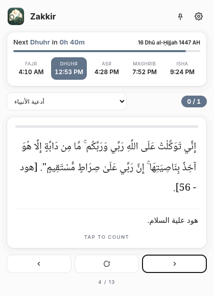
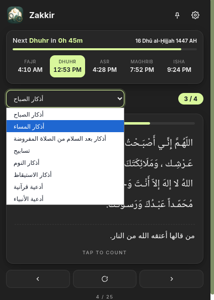
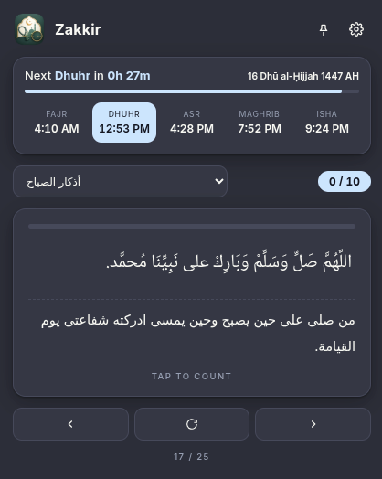

# Zakkir Desktop 🕋

> **Prayer times + Azkar (Hisn al-Muslim)**

Zakkir Desktop is a beautiful, lightweight, and pinnable desktop companion application that provides prayer times and daily Azkar. Originally designed as a browser extension, it has been refined and packaged into a native desktop application using **Electron**.

It features full theme customization, dynamic prayer calculation, desktop taskbar integration, and persistent state management.

---

## 📸 Screenshots

| Home (Light Theme) | Home (Dark Slate Theme) | Home (Dark Navy Theme) |
| :---: | :---: | :---: |
|  |  |  |

| Settings (Light Theme) | Settings (Dark Theme) | Settings (Resized Wide) |
| :---: | :---: | :---: |
|  |  |  |

---

## ✨ Features

*   **Pinnable & Resizable:** Run the app as a compact overlay or resize it to fit your desktop. It stays on top of other windows and remembers its position/dimensions.
*   **State Persistence:** Remembers your exact view, theme, and Azkar counter progress so you can resume exactly where you left off when you reopen the app.
*   **Multiple Themes:** Choose from custom Slate, Navy, Warm, and Light themes.
*   **Dynamic Prayer Times:** Automatic prayer calculations based on your specified location (City/Country) and calculation method.
*   **System Integration:** Full system taskbar icon support and clean frameless window borders.

---

## 🚀 Installation & Downloads

### 🪟 Windows
Download the latest `Zakkir Setup 1.1.0.exe` installer from the [GitHub Releases](https://github.com/mohamedsameh20/Zakkir/releases) tab. Run the installer to add Zakkir to your desktop and Start Menu.

### 🐧 Debian / Ubuntu
Download the `.deb` package or the universal `.AppImage` from the [GitHub Releases](https://github.com/mohamedsameh20/Zakkir/releases) tab.
```bash
# To install the deb package:
sudo dpkg -i zakkir-desktop_1.1.0_amd64.deb
```

### ❄️ NixOS (Flake / Home Manager)
This repository contains a native Nix package definition (`default.nix`). You can include it in your NixOS configuration or Home Manager:

1. Add the package to your package path overlay or import it directly:
   ```nix
   let
     zakkir-desktop = pkgs.callPackage ./pkgs/zakkir-desktop { };
   in
   {
     home.packages = [ zakkir-desktop ];
   }
   ```
2. Rebuild your system configuration (`nh os switch` or `nixos-rebuild`).

---

## 🛠️ Local Development

To run or build the application locally, you will need [Node.js](https://nodejs.org/) installed:

1. Clone this repository:
   ```bash
   git clone https://github.com/mohamedsameh20/Zakkir.git
   cd Zakkir
   ```
2. Install the developer dependencies:
   ```bash
   npm install
   ```
3. Run the application locally:
   ```bash
   npm start
   ```
4. Build installers for your current platform:
   ```bash
   npm run dist
   ```

---

## 🤖 Automated Builds
This repository utilizes a **GitHub Actions CI/CD pipeline** located at `.github/workflows/build.yml`. Every commit pushed to `main` triggers automated builds for Windows and Linux on real cloud runners and uploads the compiled executables directly to the **Releases** page as draft updates.
