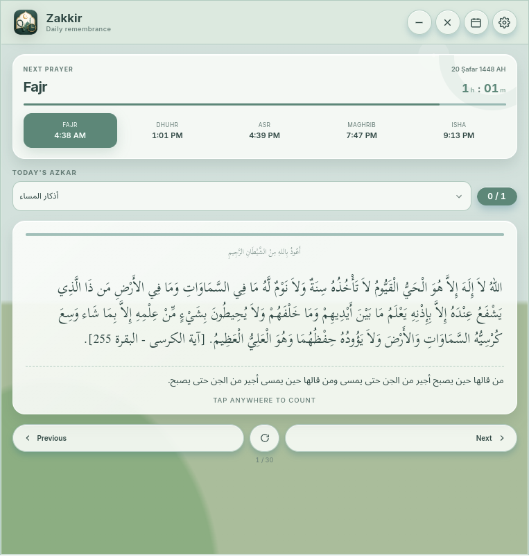
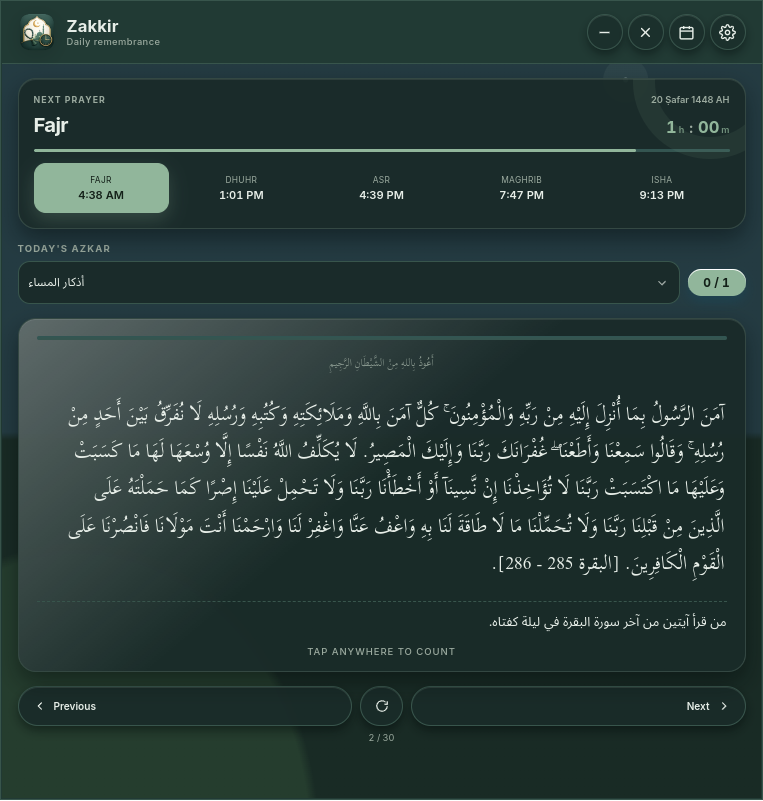
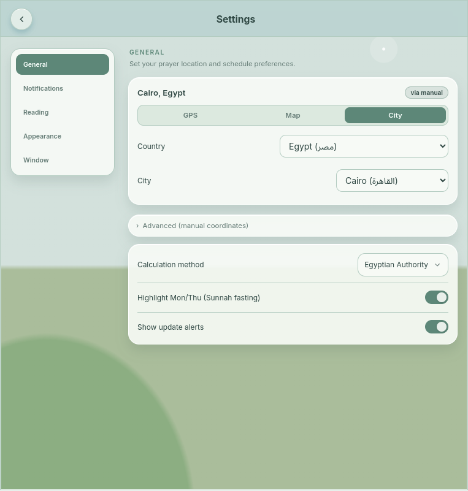
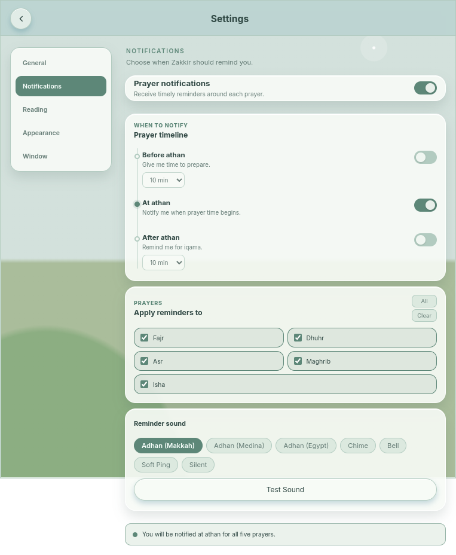
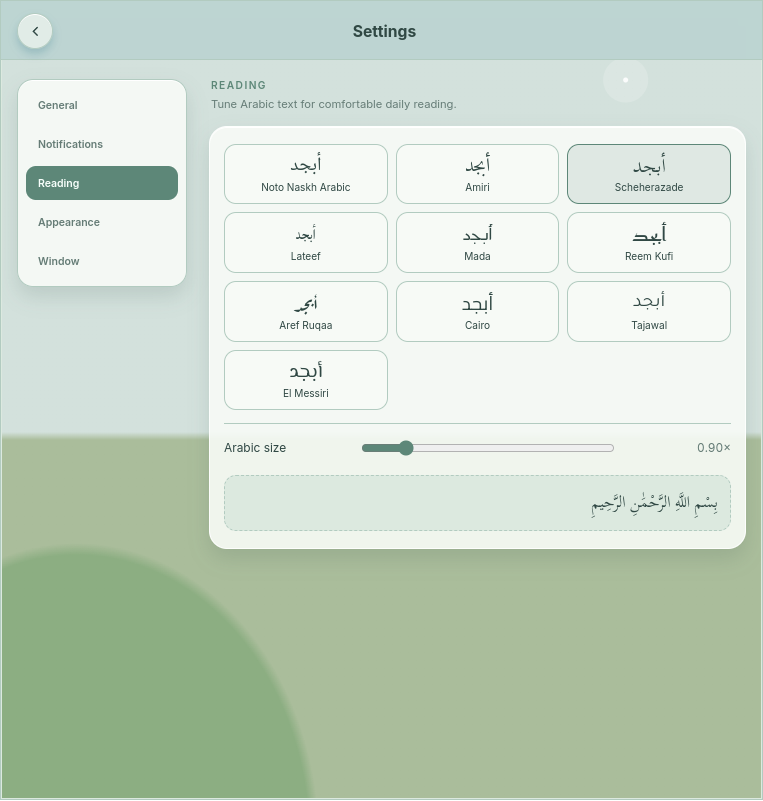
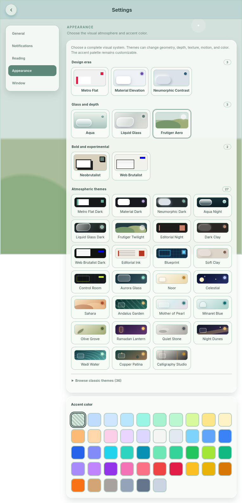
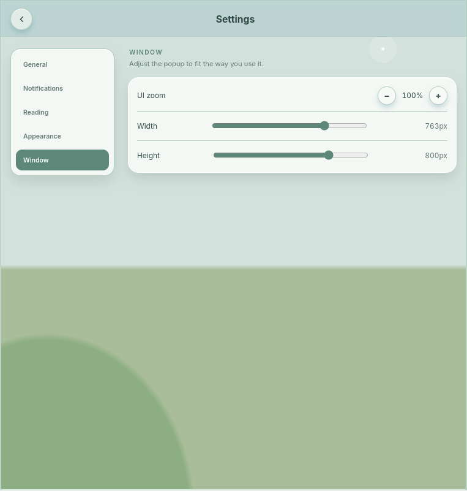

# Zakkir Desktop

A lightweight, always-on-top desktop app for **prayer times** and **Azkar** (Hisn al-Muslim), built with Electron.

Prayer times come live from [Aladhan](https://aladhan.com); Azkar are bundled locally so the app works offline.

## Download

| Platform         | Download                                                                                                                           | Install                                                     |
| ---------------- | ---------------------------------------------------------------------------------------------------------------------------------- | ----------------------------------------------------------- |
| Windows          | [Zakkir-Setup-1.4.0.exe](https://github.com/mohamedsameh20/Zakkir/releases/download/v1.4.0/Zakkir-Setup-1.4.0.exe)                 | Run the installer                                           |
| Debian / Ubuntu  | [zakkir-desktop_1.4.0_amd64.deb](https://github.com/mohamedsameh20/Zakkir/releases/download/v1.4.0/zakkir-desktop_1.4.0_amd64.deb) | `sudo dpkg -i zakkir-desktop_1.4.0_amd64.deb`               |
| Linux (AppImage) | [Zakkir-1.4.0.AppImage](https://github.com/mohamedsameh20/Zakkir/releases/download/v1.4.0/Zakkir-1.4.0.AppImage)                   | `chmod +x Zakkir-1.4.0.AppImage && ./Zakkir-1.4.0.AppImage` |

## Features

- **Prayer times** with a live next-prayer countdown and progress toward the next prayer.
- **Azkar library** with 8 categories, auto-switching between Morning and Evening collections.
- **Arabic-first reading** — 10 locally bundled fonts (Scheherazade, Amiri, Lateef, Cairo, and more), adjustable size, and separate rendering for opening basmala/istiadhah formulas.
- **70+ visual themes** including Frutiger Aero, Liquid Glass, Neobrutalist, and full dark counterparts for each family.
- **Accent palettes** — a large palette set that recolors any theme in place.
- **Tabbed settings** (General / Notifications / Reading / Appearance / Window) that switch in place without re-rendering or stuttering.
- **Prayer timeline notifications** — master switch plus independent *before*, *at*, and *after* athan reminders, per-prayer selection, reminder sounds, and a plain-language summary.
- **Flexible location** — GPS detection, embedded Leaflet map picker, city presets, or manual coordinates.
- **Always-on-top** frameless window with native controls; resizable from the Window section.
- **Offline-first** — fonts, azkar, sounds, and the map are all bundled locally.

## Screenshots

### Home

|                  Default (Frutiger Aero)                  |                  Frutiger Twilight (Dark)                  |
| :-------------------------------------------------------: | :--------------------------------------------------------: |
|  |  |

### Settings

|                     General                      |                   Notifications                    |
| :----------------------------------------------: | :------------------------------------------------: |
|  |  |

|                       Reading                       |                      Appearance                       |
| :-------------------------------------------------: | :---------------------------------------------------: |
|  |  |

|                      Window                      |
| :----------------------------------------------: |
|  |

## Development

```bash
npm install        # install dependencies
npm start          # run the app
npm test           # run the Playwright + Electron end-to-end suite
npm run pack       # build an unpacked app
npm run dist       # build distributable packages (AppImage, deb, NSIS)
```

The end-to-end suite launches the app with a temporary settings profile so every test starts from a clean, first-run state (including the default Frutiger Aero theme).

## Tech Stack

- **Electron** — desktop shell, frameless window, native notifications, IPC storage.
- **Playwright** — Electron end-to-end testing.
- **Leaflet** — embedded map picker (OpenStreetMap tiles).
- **Aladhan API** — live prayer times.

## License

MIT
